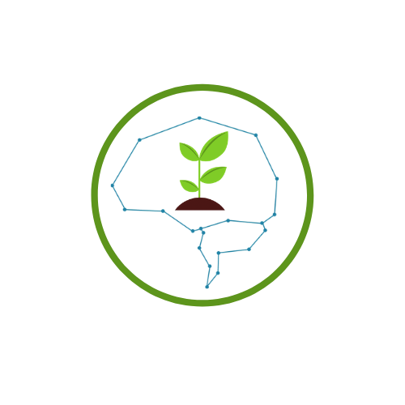

# plant-doctor

Plant Doctor is an AI Platform that helps people to detect plant diseases.

This project is launched by Spix-P. 

* [slide](https://drive.google.com/file/d/1XK-1G2Gjv74u7LyApVCDoiaUw7AZSlI9/view?usp=sharing)
* [video](https://www.youtube.com/watch?v=JN1anI0hPfc&feature=youtu.be&fbclid=IwAR3YTUHXKP9sw0eHbtpW4WQruGLkmpguIG_MX5ZO8sioOXcRXBBm7nY340E) 
* Author :   
    * Le Van Pon 
    * Nguyen Phuc Minh

Please follow the instruction of README from each folder .